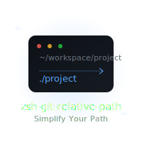

# Zsh Git Relative Path Plugin

<p align="center">
  
</p>

A ZSH plugin that shows your current path relative to the git project root in your prompt.

## Features

- Works with any oh-my-zsh theme
- Shows path relative to git project root when in a git repository
- Falls back to normal path display when not in a git repository
- Special support for popular themes (robbyrussell, agnoster, avit)
- Zero configuration needed!

## Prerequisites

- [Oh My Zsh](https://ohmyz.sh/)
- Node.js >= 14.0.0
- npm or pnpm

## Installation

### Using npm (Recommended)

```bash
npm install -g @cs-magic-open/zsh-git-relative-path
```

That's it! The plugin will be automatically configured and activated after installation.

### Alternative: Manual Installation

If you prefer to inspect the code first:

```bash
# 1. Clone the repository
git clone https://github.com/cs-magic-open/zsh-git-relative-path
cd zsh-git-relative-path

# 2. Install globally from local
npm install -g .
```

## Usage

Once installed, the plugin will automatically modify your prompt to show paths relative to the git project root. No additional configuration is needed!

Example:
```
# Before (in /Users/username/projects/my-project/src/components)
username ~/projects/my-project/src/components $

# After (same directory)
username src/components $
```

## Updating

To update to the latest version:

```bash
npm update -g @cs-magic-open/zsh-git-relative-path
```

## Uninstallation

```bash
npm uninstall -g @cs-magic-open/zsh-git-relative-path
```

## Development

To contribute or modify the plugin:

```bash
# Clone the repository
git clone https://github.com/cs-magic-open/zsh-git-relative-path
cd zsh-git-relative-path

# Install dependencies
npm install

# Make your changes...

# Bump version
npm version patch  # or minor/major
```

## License

MIT

## Author

cs-magic-open
